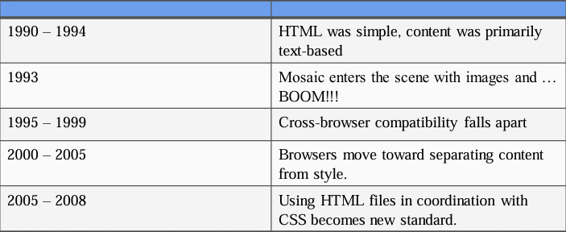
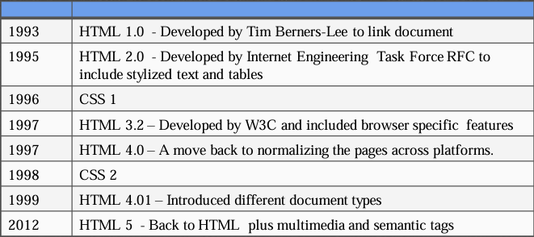

# Introduction to HTML5

## Evolution of HTML
- **HTML** - Hypertext Markup Language
  - Markup languages use *tags* to annotate 
  - tags indicate where headings (h1), images (img), list items (li), links (a), line breaks (br), and other components should be displayed.
- **Mosaic** - emerged as the first graphical browser
- **Evolution of Browsers**
- 
- 