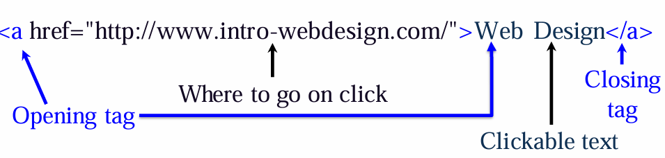
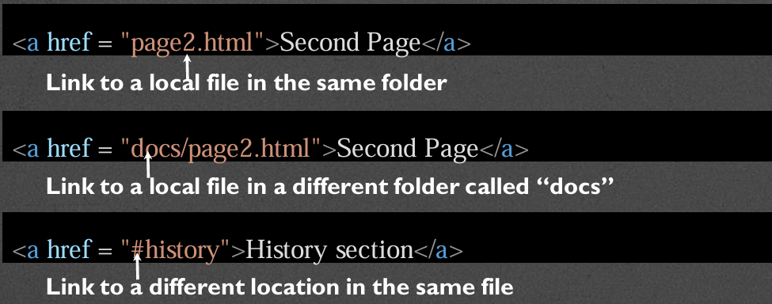

# Week 2: Structure of a Web Page

## Document Object Model (writing clean mode)
- Basis of HTML5 is "New features should be based on HTML, CSS, the DOM, and JavaScript"
- DOM provides common tree-like structure that all pages should follow
- Computer Scientists loves trees (the mathematical kind) because you can test them

### HTML is built on the DOM


### Three parts of a well-formed document
1. Doctype
    - Version of HTML that you will be using
    - HTML5
      -  ``` <!DOCTYPE html> ``` 
2. Head
    - Additional information used by the browser
      - Meta data : language, title
      - Supporting files - Javascript, Styling, Add-ons
    - Other than title, meta-data is not displayed
3. Body
    - Displayable content
    - Bulk of your page
    - Important to write well-formatted (tree-like) code.
    - Most of the content is displayed by the browser, but there may be some meta data too.

**Example**
```
<!DOCTYPE html>
<html lang="en">
<head>
    <meta charset="UTF-8">
    <title>My First Page</title>
</head>
<body>
    This should be displayed by the browser
</body>
</html>
```

- You can validate the code using www.validator.w3.org
- Well-formed pages use the DOM structure
  - Use beginning and eng tags
  - Closer inner tags before outer ones
  - Use valid attributes
- Browser will "fix" bad code, but not always well. Use a validator to check your code.


## HTML5 Tags and Syntax
- Tags have a beginning and an end
- Some tags have *attributes* (src, href, etc.,)
- 

### Display
- One of the most important attributes of an element in its display. The two most common are **block** and **inline**
  - **Block**
    - can take width and height
    - Newline is inserted before and after, e.g., it "takes up" the whole width
  - **Inline**
    - Cannot take width and height
    - Only uses as much space as needed to contain the element

### Common Tags
- **Headings (block)**
  - ```<h1>,<h2>,<h3>,<h4>,<h5>,<h6>```
  - These tags have syntax and semantics

- **Paragraphs (block)**
  - ```<p>....</p>```
  - Should only contain inline elements
- **Divs (block)**
  - ```<div>...</div>```
  - Generic section that is larger than a paragraph
- **Ordered lists**
  - ``` 
    <ol>
        <li> Item One </li>
        <li> Item two </li>
    </ol>
    ```
- **Unordered lists**
  - ```
    <ul>
        <li> Item One </li>
        <li> Item Two </li>
    </ul>
    ```
- **Line breaks**
  - ```<br>```

### Attributes
- Provides additional information about an element
- Always specified in the start tag
- Comes in name/value pairs

### Images
- Images(inline)
  - ``````
- Images rarely work the first time
  - Show a broken link, too big, too small, etc.,
- Size or carefully name your picture before using it.


### More attributes
- Some apply to any tag:
  - **class** : applies special properties to groups of elements
  - **id** : specifies a unique id to one element on the page
  - **style** : specifies a certain visual style
  - **acceskey** : a shorcut key to activate an element
  - **tabindex** : the order elements will come into focus using the tab key.

### Special Entities
- Tags always start with a bracket
- To display a bracket to not start a tag:
  - 


## Semantic HTML5 Tags
### How to design


### Using Semantic Tags
- ```<div>``` was a way to group related content together
- Divs almost always had special classes/ids associated with them
- ```
  <div class="header">...</div>
  <div class="section">...</div>
  <div class="footer">...</div>
  ```
### ```<header>```
- A group of introductory or navigational aids: title, navigation links, etc.,
- Not to be confused with ```<head>``` or the different headings

### ```<nav>```
- A section of the page that links to other pages or to parts within the page.
- Often found in the ```<header>``` tag 

### ```<footer>```
- A section that contains info such as copyright data, related documents, and link to social media
- Typically at the bottom of the page, but not required.

### ```<figure>```
- More semantic than `````` . Can include:
  - Caption
  - Multiple multimedia resources

### Other New Tags
- Structural Elements
  - article, aside, main, menuitem, summary, section
- Form Elements
  - datalist, keygen, output
- Input Types
  - color, date email, list
- Graphic Elements
  - canvas, svg
- Media Elements
  - audio, embed, source, track, video


## Images
- Many file types are widely supported
  - JPEG (.jpg and .jpeg), GIF, and PNG.
  - SVG and BMP are additional options
  - File extensions must be included
- Every image must be downloaded, so size can be a factor
- Every image requires an HTTP Request.

### Image Sizes
- When you link to an image the browser displays the image as big (or small) as the file
  - The size is rarely optional
- "Quick" solutions - change file, use width/height attributes.

### Favicons
- You can put image/logo/icon next to the title of your page (in the tab)
- Must go in ```<head>``` section
- ```<link rel="icon" type="image/png" href="imgs/logo.png">```

### Alternative Text Attribute
- Provides a textual alternative to non-text content
- Read by screen readers
- Displayed in place of images
- Provides semantic meaning for search engines


## Accessible Images
### Alternative Text Attribute
- Provides a textual alternative to non-text content
- Read by screen readers
- Displayed in place of images
- Provides semantic meaning for search engines

### Creating Good alt text
- Be accurate
- Be succinct
- Don't be redundant
- Don't include "picture of...", "graphic of..."

### Empty Alt text
- It is okay to leave alt text empty (null)
  - Decorative images used for non-informative purpose
- Do not skip the alt attribute!

### Long Alt text
- Some images may require elaborate alt text
- Consider replacing alt text with link to separate page with full explanation

### Emojis and Icons
- Description of an emoji will be read by a screen reader, but not for an icon.
- Since icons are not iamges, they cant use the alt attribute
- Instead, icons can use an aria-label attribute
- ```<i class="fa-brands fa-pinterest></i> <i class ="fa-brands fa-pinterest" aria-label="Pinterest"></i>```


## Hyperlinks
- **Links** are what make the Web a web.
- The interlinked nature of the web leads to the "knowledge" that search engines appear to have.

### Anchorlinks
- The ```<a>``` tag stands for *anchor link*
- Needs a hyper-reference AND content
  - **href** - reference to location of new content
  - **content** - the "clickable" part (text or image)
  - ``` <a href ="link">Description</a>```

### Types of links
1. Absolute
   - 
2. Relative
   - 
3. Internal
4. Graphical

### Usability Issues
- Make sure the clickable component has an informative name
- Information in the images should be available to those who can't see the image.

### Targets
- Anchors can take a target attribute
  - _self - default action
  - _blank - open in new tab or window
  - _top and _parent


## Useful Tags
- tags for blocks of code and simple snippets

### Choosing your tags
- **Generic** : ```<p>```,```<div>```
- **Semantic** : ```<header>```,```<nav>```,```<footer>```,```<figure>```

### Block Tags
- Containers
  - ```<article>```, ```<aside>```, ```<section>```, ```<main>```,...
- ```<hr>```
- ```<address>```
- ```<blockquote>``` - has **cite** attribute
- ```<details>``` with ```<summary>```

### Inline Tags
- ```<span>``` was the original inline tag for plain text
- ```<cite>```
- ```<abbr>```
- ```<time>```
- ```<code>```
- ```<sub>``` and ```<sup>```

### Tags that need "more"
- ```<button>```
- ```<meter>```
- ```<progress>```
- ```<iframe>``` - often used to embed documents
- ```<bdo>``` attribute **dir** (ltr or rtl)
- ```<map>``` with ```<area>``` - creates "clickable element in image" but needs JavaScript.