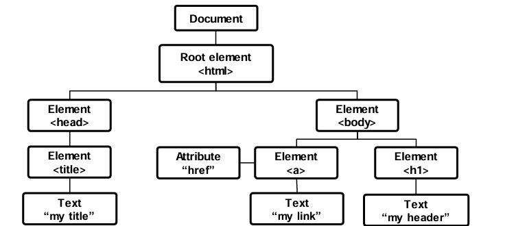
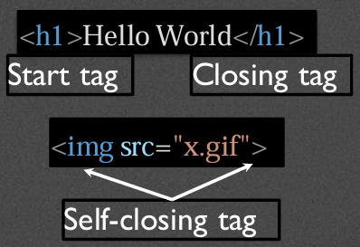
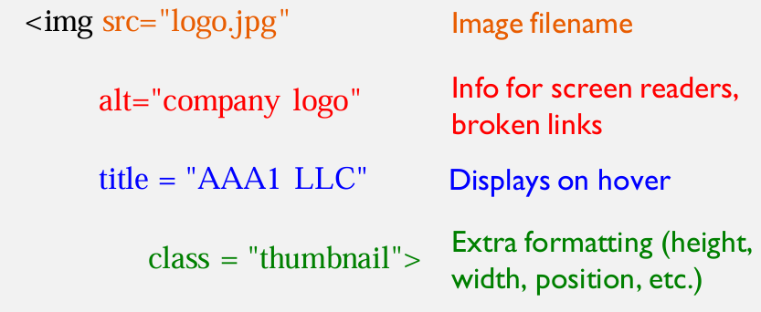
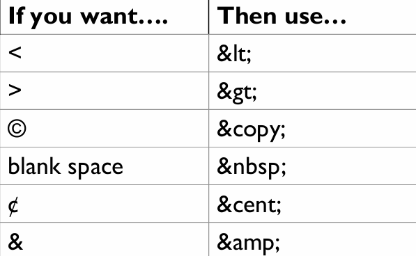
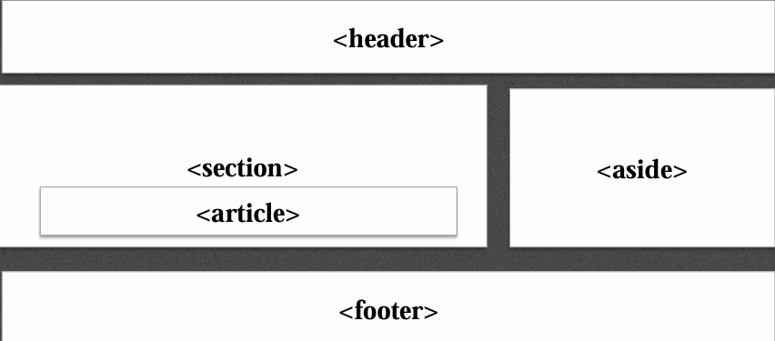

# Week 2: Structure of a Web Page

## Document Object Model (writing clean mode)
- Basis of HTML5 is "New features should be based on HTML, CSS, the DOM, and JavaScript"
- DOM provides common tree-like structure that all pages should follow
- Computer Scientists loves trees (the mathematical kind) because you can test them

### HTML is built on the DOM


### Three parts of a well-formed document
1. Doctype
    - Version of HTML that you will be using
    - HTML5
      -  ``` <!DOCTYPE html> ``` 
2. Head
    - Additional information used by the browser
      - Meta data : language, title
      - Supporting files - Javascript, Styling, Add-ons
    - Other than title, meta-data is not displayed
3. Body
    - Displayable content
    - Bulk of your page
    - Important to write well-formatted (tree-like) code.
    - Most of the content is displayed by the browser, but there may be some meta data too.

**Example**
```
<!DOCTYPE html>
<html lang="en">
<head>
    <meta charset="UTF-8">
    <title>My First Page</title>
</head>
<body>
    This should be displayed by the browser
</body>
</html>
```

- You can validate the code using www.validator.w3.org
- Well-formed pages use the DOM structure
  - Use beginning and eng tags
  - Closer inner tags before outer ones
  - Use valid attributes
- Browser will "fix" bad code, but not always well. Use a validator to check your code.

## HTML5 Tags and Syntax
- Tags have a beginning and an end
- Some tags have *attributes* (src, href, etc.,)
- 

### Display
- One of the most important attributes of an element in its display. The two most common are **block** and **inline**
  - **Block**
    - can take width and height
    - Newline is inserted before and after, e.g., it "takes up" the whole width
  - **Inline**
    - Cannot take width and height
    - Only uses as much space as needed to contain the element

### Common Tags
- **Headings (block)**
  - ```<h1>,<h2>,<h3>,<h4>,<h5>,<h6>```
  - These tags have syntax and semantics

- **Paragraphs (block)**
  - ```<p>....</p>```
  - Should only contain inline elements
- **Divs (block)**
  - ```<div>...</div>```
  - Generic section that is larger than a paragraph
- **Ordered lists**
  - ``` 
    <ol>
        <li> Item One </li>
        <li> Item two </li>
    </ol>
    ```
- **Unordered lists**
  - ```
    <ul>
        <li> Item One </li>
        <li> Item Two </li>
    </ul>
    ```
- **Line breaks**
  - ```<br>```

### Attributes
- Provides additional information about an element
- Always specified in the start tag
- Comes in name/value pairs

### Images
- Images(inline)
  - ``````
- Images rarely work the first time
  - Show a broken link, too big, too small, etc.,
- Size or carefully name your picture before using it.


### More attributes
- Some apply to any tag:
  - **class** : applies special properties to groups of elements
  - **id** : specifies a unique id to one element on the page
  - **style** : specifies a certain visual style
  - **acceskey** : a shorcut key to activate an element
  - **tabindex** : the order elements will come into focus using the tab key.

### Special Entities
- Tags always start with a bracket
- To display a bracket to not start a tag:
  - 


## Semantic HTML5 Tags
### How to design


### Using Semantic Tags
- ```<div>``` was a way to group related content together
- Divs almost always had special classes/ids associated with them
- ```
  <div class="header">...</div>
  <div class="section">...</div>
  <div class="footer">...</div>
  ```
### ```<header>```
- A group of introductory or navigational aids: title, navigation links, etc.,
- ```<header>
        <h1>This is the Title</h1>
        <h2>The author is Colleen</h2>
    </header>```
- Not to be confused with ```<head>``` or the different headings

### ```<nav>```
- A section of the page that links to other pages or to parts within the page.
- ```
<nav>
    <ul>
        <li>...</li>
        <li>...</li>
        <li>...</li>
    </ul>
</nav>
```
- Often found in the ```<header>``` tag
